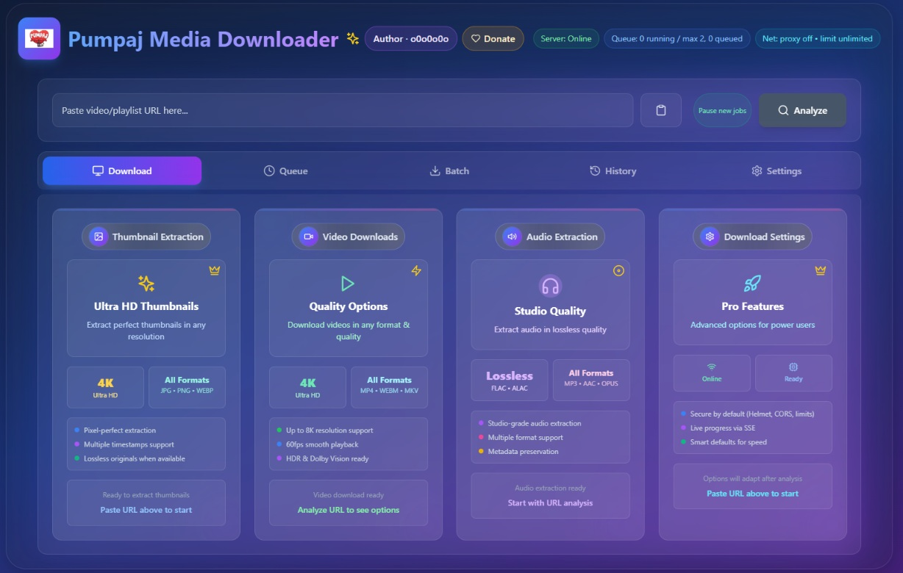
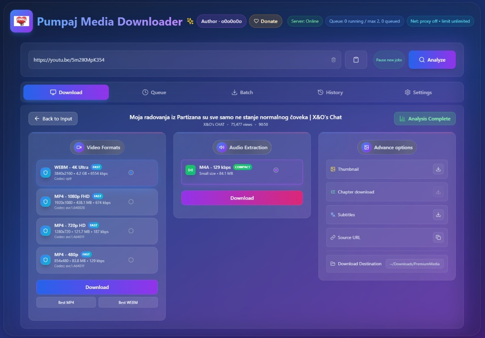

<div align="center">

   

   <h1>Pumpaj Media Downloader</h1>

   [](https://www.paypal.com/paypalme/o0o0o0o0o0o0o)

   <p>
      Dual‑mode, premium‑grade media downloader. Web app (Vite + React) and Desktop app (Electron)
      powered by yt‑dlp + ffmpeg, with real‑time progress, smart queueing, and a clean, modern UI.
   </p>

   <p>
         <a href="https://github.com/o0o0o0o0o0o0o0o0o0o0o0o0o0o0o0o/pumpaj_video_downloader/actions/workflows/ci.yml"></a>
   <a href="https://img.shields.io/badge/Node-%3E%3D18.18-339933?logo=node.js&logoColor=white"></a>
   <a href="https://vitejs.dev"></a>
   <a href="https://nextjs.org"></a>
   <a href="https://react.dev"></a>
   <a href="https://expressjs.com"></a>
   <a href="https://www.electronjs.org"></a>
      
      
      
   </p>

   <p>
      <a href="#features-at-a-glance">English</a> • <a href="#-srpski-serbian">Srpski</a>
   </p>

</div>

## ✨ Features at a glance

- Analyze any supported URL via yt‑dlp and present clean Video / Audio / Thumbnails options
- Server‑side job queue with live progress (SSE), cancel single job or Cancel All
- Concurrency limits, temp‑file hygiene, and automatic cleanup
- Desktop mode (Electron): embedded server, IPC controls (Open Downloads, Pause/Resume new jobs)
- Policy system for feature limits (FREE vs PREMIUM)
- Beautiful UI with quick actions, keyboard shortcuts, and status badges

## 🧱 Architecture

- Frontend: Vite + React + TypeScript (port 5183, strict)
- Backend: Express + yt‑dlp + ffmpeg (default port 5176)
- Desktop: Electron wrapper with IPC, embedded Express server
- Realtime: Server‑Sent Events (SSE) for progress updates
- Storage: JSON files in `server/data/` (settings, users, history) with migration from legacy paths

Repository layout highlights:

- `src/` – React app components and client libs
- `server/` – Express server, routes, and core utilities
- `electron/` – Desktop entry, preload, and packaging
- `tools/` – Dev scripts (stop, clean, smoke, clean‑data)

## 📦 Requirements

- Node.js >= 20 (LTS). Repo sadrži `.nvmrc`, pa je dovoljno pokrenuti `nvm use` da preuzme tačnu verziju.
- Windows is the primary target for the desktop build; the web app runs cross‑platform

## 🚀 Quick start (development)

Select Node version:

```powershell
nvm use
```

Install dependencies (root manages the workspace and the server package):

```powershell
npm install
```

Start both frontend and backend (recommended):

```powershell
npm run dev:start:all
```

Start individually:

```powershell
# Frontend (Vite on http://localhost:5183)
npm run dev:start:frontend

# Backend (Express on http://localhost:5176)
npm run dev:start:backend
```

Stop stuck dev ports and clean temp artifacts:

```powershell
npm run dev:stop
npm run dev:clean
```

Start with a clean data slate (removes dist/, logs/, and server data):

```powershell
npm run dev:clean:data
```

Smoke test (server health):

```powershell
npm run dev:smoke
```

### ✅ Pre-release verification

```powershell
npm run test -w server
npm run verify
```

`npm run test -w server` pokreće brze API health testove (Vitest + Supertest) sa `NODE_ENV=test`. 
`npm run verify` zatim pokriva lint, oba typechecka, buildove i sve testove, identično onome što prolazi u CI pipeline-u.

## 🤖 Continuous integration

- Svaki push na `main` i svaki Pull Request pokreće [CI workflow](https://github.com/o0o0o0o0o0o0o0o0o0o0o0o0o0o0o0o/pumpaj_video_downloader/actions/workflows/ci.yml)
- Workflow koristi Node 20, radi `npm ci`, zatim `npm run verify`, pa zato lokalno izvršavanje `verify` + `test -w server` garantuje zelen build
- Artefakti se ne objavljuju iz CI-a (Railway/Vercel deploy se radi ručno prema [production runbooku](docs/production-setup.md)), ali izlaz iz CI-a služi kao gate pre merge-a/deploya
- Dnevni [Production Smoke Tests](https://github.com/o0o0o0o0o0o0o0o0o0o0o0o0o0o0o0o/pumpaj_video_downloader/actions/workflows/smoke-prod.yml) workflow (06:00 UTC) + ručni trigger proveravaju da su Vercel frontend i Railway backend dostupni (`tools/smoke-prod.ps1` validira web landing, `/health` (`ok: true`) i `/api/version` meta podatke)

## 🖥️ Desktop (Electron) development

For a desktop experience with IPC controls:

```powershell
# Build UI once in watch mode and run Electron
npm run dev:ipc
```

Production build (Windows portable + zip):

```powershell
npm run dist:win
```

This bundles the web UI, the prebuilt server, and binaries into a portable app.

## 🌐 Web build (static)

```powershell
npm run build:all
npm run preview
```

`npm run build:all` first bundles the Vite desktop UI and then exports the Next.js web app, mirroring the production pipeline. See [`docs/DEPLOY.md`](docs/DEPLOY.md) for a full pre-release checklist (env vars, smoke tests, packaging steps).

`vite build` outputs to `dist/`. `vite preview` serves the static build locally.

## ⚙️ Configuration

Frontend
- Start from the template and adjust as needed:

   ```powershell
   copy web/.env.example web/.env.local
   ```

- `.env.local`
    - `NEXT_PUBLIC_API=http://localhost:5176` (frontend → backend bridge for the Next.js web app)
    - `NEXT_PUBLIC_SUPABASE_URL=https://<project>.supabase.co`
    - `NEXT_PUBLIC_SUPABASE_ANON_KEY=<anon-key>`
    - (Legacy Vite UI) `VITE_API_BASE=http://localhost:5176`
    - At runtime the app auto‑detects the backend too: query param `?apiBase=`, `window.__API_BASE`, and file:// heuristic for desktop

Backend (environment)
- Copy the sample and fill in the values you need:

   ```powershell
   copy server/.env.example server/.env
   ```

- Key flags:
    - `PORT=5176` (ili željeni port)
    - `CORS_ORIGIN=*` (dozvole; može i lista domena)
    - `ALLOWED_HOSTS=...` (SSRF zaštita)
    - `APP_JWT_SECRET`, `APP_JWT_PUBLIC_KEY`, `APP_JWT_PRIVATE_KEY` (Supabase / JWT most)
    - `MAX_FILESIZE_MB`, `MAX_DURATION_SEC`, `PROXY_DOWNLOAD_MAX_PER_MIN` (soft limiti)

Data directory (canonical)
- `server/data/` holds runtime JSON files:
   - `settings.json` – server settings (port, limits, etc.)
   - `history.json` – completed/transient jobs history
   - `users.json` – user plans and identities
- On first run, the server migrates old files from legacy paths (e.g., `server/server/data/`).
- Git ignores these files; use `npm run dev:clean:data` to reset.

## 🌍 Production deployment

For the latest production checklist with domains and credentials, see [`docs/production-setup.md`](docs/production-setup.md). Quick recap:

1. **Railway (Express API)**
   - Variables: `PORT=8080`, `NIXPACKS_NODE_VERSION=20`, `CORS_ORIGIN=https://pumpajvideodown.vercel.app`
   - Optional safety: `ALLOWED_HOSTS=youtube.com,youtu.be`
2. **Vercel (Next.js web)**
   - Production env vars: `NEXT_PUBLIC_API`, `NEXT_PUBLIC_SUPABASE_URL`, `NEXT_PUBLIC_SUPABASE_ANON_KEY`
   - Project protection: keep Vercel Authentication disabled for public access, or issue a share link.
3. **Deploy**
   ```powershell
   # Backend
   railway up

   # Frontend
   vercel deploy --prod --yes
   vercel alias set <deployment-url> pumpajvideodown.vercel.app
   ```
4. **Smoke test**
   ```powershell
   npm run smoke:prod
   ```
   Confirms `https://pumpajvideodown.vercel.app` returns 200 and the Railway `/health` endpoint is OK.

> ℹ️  The repository root contains `vercel.json` which routes all requests into the `web/` Next.js app. Keep that file in sync if you move directories.

## ⌨️ Keyboard shortcuts

- Ctrl+1..5 – Switch tabs (Download / Queue / Batch / History / Settings)
- Enter – Analyze (on Download tab)
- Ctrl+L – Focus URL input

## 🔌 Job API (server)

- Start best video+audio: `POST /api/job/start/best { url, title } → { id }`
- Start best audio: `POST /api/job/start/audio { url, title, format } → { id }`
- Progress SSE: `GET /api/progress/:id` (events: `message`, `end`)
- Cancel job: `POST /api/job/cancel/:id`
- Cancel all: `POST /api/jobs/cancel-all`
- Download artifact: `GET /api/job/file/:id` (supports `HEAD`; auto‑cleans on stream close)
- Metrics: `GET /api/jobs/metrics` → `{ running, queued, maxConcurrent }`
- Settings:
   - `GET /api/jobs/settings` → `{ maxConcurrent, proxyUrl?, limitRateKbps? }`
   - `POST /api/jobs/settings { ... }` – persists and updates the scheduler live

## 🧩 Troubleshooting

- Frontend port 5183 already in use
   - A Vite instance is already running; run:
      ```powershell
      npm run dev:stop
      ```
- Backend unreachable from the UI
   - Verify health:
      ```powershell
      curl http://localhost:5176/health
      ```
      Expect `{ "ok": true }`. If you run on a non‑default port, set `VITE_API_BASE`.
- yt‑dlp / ffmpeg
   - The server uses `youtube-dl-exec` and `ffmpeg-static`. Desktop builds bundle binaries. Ensure network access for yt‑dlp updates if needed.
- Proxy/Rate limits
   - Configure via Settings in the UI or POST to `/api/jobs/settings` (proxy URL, bandwidth caps).

## 🔒 Security & policies

- Security middleware: helmet, rate limiting, HPP, SSRF guard, CORS
- Policy system gates max quality, concurrency, playlist limits, and features per plan (FREE vs PREMIUM)

## 🤝 Contributing

PRs and issues are welcome. Keep changes focused, and include a short description, screenshots for UI changes, and steps to test.

## 🙏 Acknowledgements

- yt‑dlp – amazing open‑source downloader
- ffmpeg / ffprobe – media swiss‑army knives
- Vite + React – the modern web dev stack

## 📸 Screenshots

Real app UI, captured from the current build:

<div align="center">



<br /><br />



</div>

## 🇷🇸 Srpski (Serbian)

### 📖 Opis

Pumpaj Media Downloader je dvo‑modni downloader: Web aplikacija (Vite + React) i Desktop aplikacija (Electron) pokretana yt‑dlp + ffmpeg alatima, sa praćenjem napretka u realnom vremenu (SSE), pametnim redom poslova i modernim UI‑jem.

### ✨ Ključne funkcije

- Analiza URL‑ova pomoću yt‑dlp i jasan prikaz Video / Audio / Thumbnail opcija
- Serverski red poslova sa živim napretkom, otkazivanjem jednog posla ili svih
- Ograničenja konkurentnosti, rad sa privremenim fajlovima i automatsko čišćenje
- Desktop režim (Electron): ugradjeni server, IPC kontrole (Open Downloads, Pause/Resume)
- Sistem politika (FREE vs PREMIUM) za ograničenje kvaliteta, funkcija i paralelizma
- Lep, brz UI sa prečicama na tastaturi i status bedževima

### 🧱 Arhitektura

- Frontend: Vite + React + TypeScript (port 5183, striktno)
- Backend: Express + yt‑dlp + ffmpeg (podrazumevano 5176)
- Desktop: Electron omotač sa IPC‑om i ugradjenim serverom
- Realtime: SSE za napredak preuzimanja
- Skladište: JSON fajlovi u `server/data/` (settings, users, history) uz migraciju sa starih putanja

Struktura repozitorijuma (skraćeno):
- `src/` – React komponentе i klijentske biblioteke
- `server/` – Express server, rute i pomoćne funkcije
- `electron/` – Desktop ulazne tačke i build
- `tools/` – skripte za razvoj (stop, clean, smoke, clean‑data)

### 📦 Zahtevi

- Node.js >= 18.18
- Windows je primarni cilj za desktop build; web radi na svim platformama

### 🚀 Brzi start (razvoj)

Instalacija zavisnosti:

```powershell
npm install
```

Pokretanje oba servisa:

```powershell
npm run dev:start:all
```

Pojedinačno pokretanje:

```powershell
# Frontend (Vite, http://localhost:5183)
npm run dev:start:frontend

# Backend (Express, http://localhost:5176)
npm run dev:start:backend
```

Zaustavljanje portova i čišćenje artefakata:

```powershell
npm run dev:stop
npm run dev:clean
```

Čist početak podataka (briše dist/, logs/ i server/data):

```powershell
npm run dev:clean:data
```

Smoke test (zdravlje servera):

```powershell
npm run dev:smoke
```

### ✅ Verifikacija pre objave

```powershell
npm run verify
```

Pokreće lint, typecheck, buildove (desktop + web) i testove — isto što i CI.

### 🖥️ Desktop (Electron)

Razvoj sa IPC kontrolama:

```powershell
npm run dev:ipc
```

Proizvodni build (Windows portable + zip):

```powershell
npm run dist:win
```

### 🌐 Web build

```powershell
npm run build:all
npm run preview
```

`npm run build:all` prvo izgradi Vite desktop UI, a zatim Next.js web aplikaciju (isto kao CI). Nakon uspešnog builda, `npm run preview` služi statički sadržaj za finalnu proveru.

### ⚙️ Konfiguracija

Frontend
- Počni od šablona i prilagodi vrednosti:

  ```powershell
  copy web/.env.example web/.env.local
  ```

- `.env.local`
   - `NEXT_PUBLIC_API=http://localhost:5176`
   - `NEXT_PUBLIC_SUPABASE_URL=https://<projekat>.supabase.co`
   - `NEXT_PUBLIC_SUPABASE_ANON_KEY=<anon>`
   - (Za legacy Vite UI) `VITE_API_BASE=http://localhost:5176`
   - UI uvek pokušava i auto‑detekciju: query `?apiBase=`, `window.__API_BASE`, heuristika za `file://`

Backend (okruženje)
- Kopiraj šablon i popuni vrednosti:

  ```powershell
  copy server/.env.example server/.env
  ```

- Bitna podešavanja:
   - `PORT=5176` (ili željeni port)
   - `CORS_ORIGIN=*` (ili lista domena)
   - `ALLOWED_HOSTS=...` (SSRF zaštita)
   - `APP_JWT_SECRET`, `APP_JWT_PUBLIC_KEY`, `APP_JWT_PRIVATE_KEY` (Supabase most)
   - `MAX_FILESIZE_MB`, `MAX_DURATION_SEC`, `PROXY_DOWNLOAD_MAX_PER_MIN`

Direktorijum sa podacima (kanonski)
- `server/data/` sadrži:
   - `settings.json` – podešavanja servera (port, limiti…)
   - `history.json` – istorija poslova
   - `users.json` – korisnici i planovi
- Na prvom startu server migrira fajlove sa starih putanja (npr. `server/server/data/`).
- Verziona kontrola ignoriše ove fajlove; koristi `npm run dev:clean:data` za reset.

### 🌍 Produkcija (sažeto)

Detaljan vodič je u [`docs/production-setup.md`](docs/production-setup.md). Najkraće:

1. **Railway** – `PORT=8080`, `NIXPACKS_NODE_VERSION=20`, `CORS_ORIGIN=https://pumpajvideodown.vercel.app` (+ opciono `ALLOWED_HOSTS`)
2. **Vercel** – podesi `NEXT_PUBLIC_API`, `NEXT_PUBLIC_SUPABASE_URL`, `NEXT_PUBLIC_SUPABASE_ANON_KEY` u Production okruženju i isključi Vercel Authentication ako želiš javni pristup
3. **Deploy komande**
   ```powershell
   railway up
   vercel deploy --prod --yes
   vercel alias set <deployment-url> pumpajvideodown.vercel.app
   ```
4. **Brza provera** – `npm run smoke:prod` testira i web i backend `/health`

`vercel.json` u korenu repozitorijuma rutira sve zahteve ka `web/` Next.js aplikaciji – ažuriraj ga ako promeniš strukturu.

### ⌨️ Prečice na tastaturi

- Ctrl+1..5 – promene tabova (Download / Queue / Batch / History / Settings)
- Enter – Analyze (na Download tabu)
- Ctrl+L – fokusira URL polje

### 🔌 Job API (server)

- Start best video+audio: `POST /api/job/start/best { url, title } → { id }`
- Start best audio: `POST /api/job/start/audio { url, title, format } → { id }`
- Napredak (SSE): `GET /api/progress/:id` (eventovi: `message`, `end`)
- Otkazivanje: `POST /api/job/cancel/:id`
- Otkazivanje svih: `POST /api/jobs/cancel-all`
- Preuzimanje artefakta: `GET /api/job/file/:id` (podržava `HEAD`; auto‑čišćenje na kraj strima)
- Metriке: `GET /api/jobs/metrics` → `{ running, queued, maxConcurrent }`
- Podešavanja:
   - `GET /api/jobs/settings` → `{ maxConcurrent, proxyUrl?, limitRateKbps? }`
   - `POST /api/jobs/settings { ... }` – čuva i primenjuje odmah

### 🧩 Rešavanje problema

- Port 5183 zauzet (frontend)
   - Vite već radi. Pokreni:
      ```powershell
      npm run dev:stop
      ```
- UI ne vidi backend
   - Proveri zdravlje:
      ```powershell
      curl http://localhost:5176/health
      ```
      Očekuj `{ "ok": true }`. Ako koristiš drugi port, postavi `VITE_API_BASE`.
- yt‑dlp / ffmpeg
   - Server koristi `youtube-dl-exec` i `ffmpeg-static`. Desktop build ih pakuje uz aplikaciju.
- Proxy / ograničenje brzine
   - Podesi u Settings u UI‑ju ili preko `POST /api/jobs/settings`.

### 🔒 Bezbednost i politike

- Middleware: helmet, rate limiting, HPP, zaštita od SSRF, CORS
- Politike: ograničavaju maksimalni kvalitet, konkurentnost, veličinu plejlista i dostupne funkcije po planu (FREE/PREMIUM)

### 🤝 Doprinos

## 📸 Screenshots

Real app UI, captured from the current build:

<div align="center">


<br /><br />


</div>

Tips:
- Store images under `docs/` so GitHub can render them in the README.
- Keep widths around 900–1200px to stay crisp but repo‑friendly.

Dobrodošli su PR‑ovi i issue‑i. Molimo pošaljite fokusirane izmene, kratak opis, screenshot za UI izmene i korake za testiranje.

